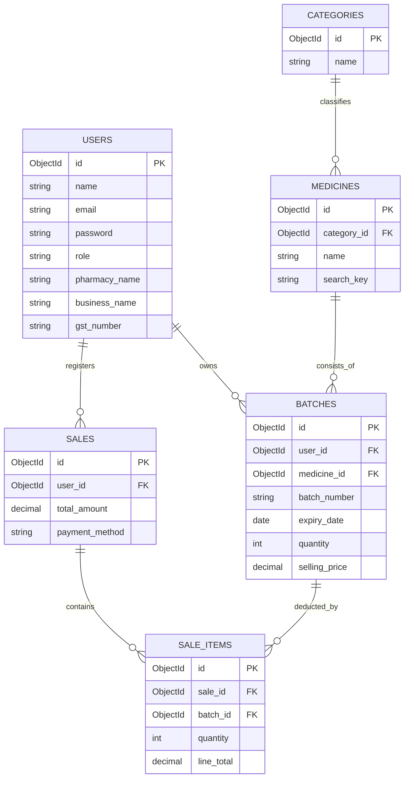
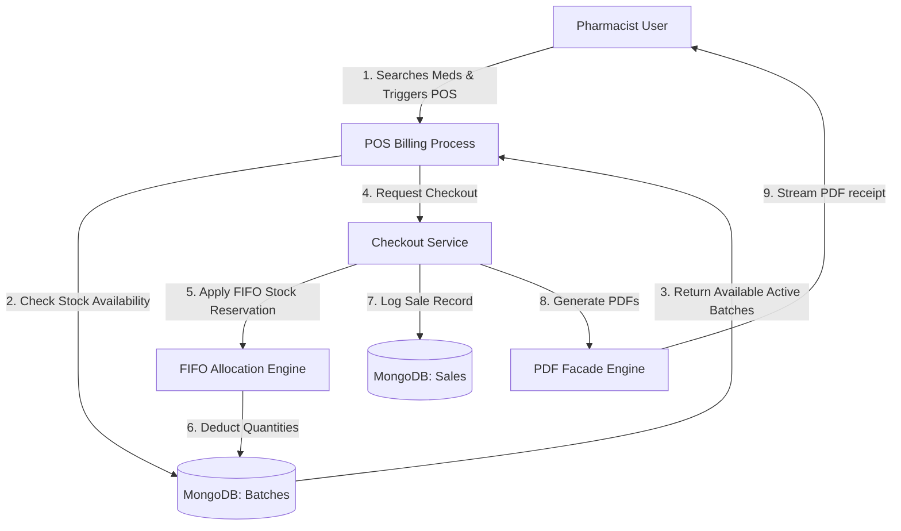
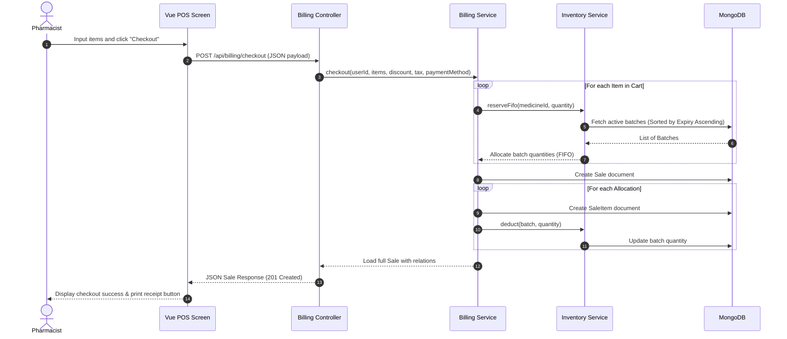

# Software Requirements Specification (SRS)
## Project: RxRetail Pharmacy POS & Inventory Management System

---

## 1. Basic Project Information

*   **Project Title:** RxRetail: Next-Generation Retail Pharmacy POS & B2B Inventory Management System
*   **Domain / Category of Project:** Healthcare Informatics, B2B Web Applications, Point of Sale (POS) and Pharmacy Inventory Solutions.
*   **Course Code & Course Name:** INT221: Web Application Development (Capstone / Term Project)
*   **Team Members & Registration Numbers:**
    1.  *Lead Full-Stack Developer:* Student A (Reg. No: 12304567)
    2.  *Frontend Engineer & UI/UX Designer:* Student B (Reg. No: 12308910)
    3.  *Backend & Database Architect:* Student C (Reg. No: 12301112)
*   **Guide / Mentor Name:** Dr. Amit Kumar Sharma, Associate Professor, Department of Computer Science and Engineering
*   **Academic Session / Semester:** Spring Semester (Session 2025–2026), 6th Semester

---

## 2. Project Overview

### 2.1 Problem Statement
Retail pharmacies face major challenges managing their daily operations due to disconnected systems. Key problems include:
*   **Manual Batch Tracking:** Checking manufacture and expiry dates manually is slow and error-prone, leading to expired medications sitting on shelves or accidentally being sold.
*   **Inefficient Checkout:** Point-of-Sale (POS) interfaces are often slow, lack real-time stock validations, and do not prioritize selling older batches first (FIFO), causing financial loss.
*   **Supplier Disconnection:** Pharmacists must order wholesale stock through external channels (phone calls, emails, messaging), which lags, creates paperwork, and leads to inventory stockouts.
*   **Rigid Database Schemas:** Traditional relational databases struggle to store highly variable medicine attributes and batch configurations without complex migrations.

### 2.2 Purpose of the Project
The primary purpose of **RxRetail** is to bridge the gap between retail pharmacy operations and supplier pipelines. By providing a real-time, responsive single-page web portal, RxRetail:
1.  Provides a fast, high-performance retail POS checkout for pharmacists.
2.  Ensures stock reduction follows a strict **First-In, First-Out (FIFO)** strategy based on medicine batch expiry dates.
3.  Connects pharmacists directly to an active B2B supplier marketplace, allowing integrated bulk order submissions and automated stock dispatch.
4.  Utilizes a modern document-oriented database architecture (MongoDB) to support flexible, hierarchical data structures (like multi-item order documents and dynamic medicine specs).

### 2.3 Scope of the Project
RxRetail covers:
*   **User Registration & Authentication:** Secure, role-based authentication separating Pharmacist and Supplier dashboards.
*   **Inventory & Batch Control:** Dynamic addition of medicine catalogs and granular tracking of individual batches (purchase price, selling price, expiry date, current quantity, profit margins).
*   **Automated Alerting Engine:** Real-time stock scans creating warning or critical alerts for low stock levels or upcoming medicine expirations.
*   **B2B Ordering System:** Cart system allowing pharmacists to bulk-order medicines directly from registered suppliers on the platform. Fulfilling an order automatically updates inventories on both ends.
*   **Interactive Analytics:** Visual dashboards containing sales progress sparklines, top-selling categories, stock health logs, and financial projections.
*   **Professional Document Generation:** Auto-generating downloadable PDF invoices (A4 format) and thermal POS receipts (80mm format) for retail customers.

### 2.4 Objectives and Goals
*   **Minimize Wasted Stock:** Automatically flag batches expiring within 30 days and resolve them before expiration.
*   **Enhance Checkout Speeds:** Keep POS search latencies under 150ms using MongoDB indexing.
*   **Streamline Procurement:** Reduce procurement cycles from days to minutes by integrating supplier storefronts directly.
*   **Robust Data Architecture:** Enable zero-down-time schema updates by leveraging a document-based NoSQL database layout.

### 2.5 Target Users
1.  **Independent Pharmacists / Cashiers:** Manage active retail storefronts, print customer invoices, and monitor stock health.
2.  **Wholesale Pharmaceutical Suppliers:** Maintain a catalog of wholesale items, receive pharmacy purchase requests, and dispatch batches directly through the platform.
3.  **Pharmacy Owners / Admins:** Review financial analytics, inspect supplier transaction records, and monitor overall business profitability.

### 2.6 Real-World Use Case
*   **Retail Sale:** A customer enters the pharmacy with a prescription for *Paracetamol 650mg*. The pharmacist searches the medicine on the POS Billing screen, enters the quantity, and checks out. Under the hood, the system queries active, non-expired batches of Paracetamol, assigns the oldest-expiring batches first (FIFO), deducts their quantities, updates the pharmacist's low-stock alerts, and streams a downloadable A4 PDF invoice.
*   **B2B Procurement:** Seeing a low-stock alert for *Amoxicillin*, the pharmacist navigates to the B2B Supplier portal, selects a verified supplier, adds Amoxicillin to a wholesale order cart, and submits the order. The supplier sees a real-time notification on their dashboard, reviews the request, and clicks "Approve." The supplier's inventory is instantly decremented, and a brand new batch of Amoxicillin is auto-created in the pharmacist's stock under a generated supplier batch number.

### 2.7 Existing System Drawbacks
*   **Legacy Desktop Databases:** Frequently lose data due to local storage failures; lack cloud accessibility.
*   **Siloed Workflows:** Inventory tracking, billing, and supplier orders require separate software tools, causing manual data double-entry.
*   **No Expiry Protection:** Cashiers must visually inspect physical bottles for expiry dates during checkouts, leading to errors.
*   **High Setup Overhead:** High hosting costs and complicated relational DB migrations make it difficult for small-scale local pharmacies to adopt.

### 2.8 Proposed Solution Advantages
*   **Unified B2B + Retail POS Portal:** A single system handles retail billing, inventory batches, and wholesale supplier ordering.
*   **FIFO Expiry Enforcement:** Automated FIFO stock allocation ensures expiring medicines are sold first, dramatically reducing waste.
*   **Modern SPA Front-End:** Inertia.js coupled with Vue 3 and Tailwind CSS v4 delivers a desktop-app feel with fluid transitions.
*   **Flexible Schema with MongoDB:** Easily adapts to varying drug details (e.g., dosage forms, chemical compositions, storage temperature limits) using dynamic document storage.

---

## 3. Project Features

### 3.1 Feature 1: User Account Registration & Role Setup
*   **Description:** Allows new users to create accounts as either a Pharmacist or a Supplier, setting up role-specific configurations.
*   **Inputs:** Full Name, Email, Password, Password Confirmation, and Role Selection (`pharmacist` or `supplier`).
*   **Process / Workflow:**
    1.  User enters credentials on the registration page and selects a role.
    2.  The front-end validates inputs and submits via an Inertia.js POST request to `/register`.
    3.  The backend hashes the password using bcrypt, creates a user document in MongoDB with default profiles, and logs the user in.
*   **Outputs:** Account creation success toast, redirection to the role-specific dashboard page.
*   **Validations:**
    *   `name`: Required, string, max 255.
    *   `email`: Required, unique in `users` collection, valid email format.
    *   `password`: Required, minimum 8 characters, must match `password_confirmation`.
    *   `role`: Must be either `pharmacist` or `supplier`.
*   **Error Handling:** If validation fails, Laravel returns a `422 Unprocessable Entity` containing error messages mapped to specific fields, which Vue highlights in the UI without wiping the form.

### 3.2 Feature 2: FIFO-Based Retail Billing / POS Checkout
*   **Description:** Pharmacists build shopping carts for customers, search live inventories, and process retail sales.
*   **Inputs:** Items array (each with `medicine_id` and `quantity`), `discount` (optional), `tax` (optional), `customer_name` (optional), `customer_phone` (optional), `payment_method` (`cash`, `upi`, `card`, `insurance`).
*   **Process / Workflow:**
    1.  Pharmacist searches medicines using the real-time POS search bar.
    2.  POS pulls sellable active batches sorted by `expiry_date` ascending.
    3.  On checkout, `BillingService` executes `reserveFifo` to locate non-expired stock sequentially across multiple batches.
    4.  The system creates a `Sale` document, creates corresponding `SaleItem` documents, decrements batch quantities, triggers background inventory alert recalculations, and returns the sale details.
*   **Outputs:** Printed 80mm PDF thermal receipt, downloadable A4 PDF invoice, and updated database quantities.
*   **Validations:**
    *   `items`: Required array, minimum 1 item.
    *   `items.*.medicine_id`: Must exist in `medicines` collection.
    *   `items.*.quantity`: Positive integer, minimum 1, must not exceed total available non-expired stock.
    *   `discount` / `tax`: Non-negative decimal numbers.
    *   `payment_method`: Must be one of `cash`, `upi`, `card`, or `insurance`.
*   **Error Handling:** Insufficient stock or expired batch errors throw a custom `ValidationException` displaying a banner like *"Paracetamol has only 5 sellable units available."* back to the POS.

### 3.3 Feature 3: Automated Inventory Alerts Engine
*   **Description:** A background monitoring system that detects critical and low stock levels or expiring batches.
*   **Inputs:** Triggered automatically upon stock updates (e.g., POS transactions, supplier order arrivals).
*   **Process / Workflow:**
    1.  `InventoryService::generateAlerts` scans the user's batches grouped by medicine.
    2.  If the aggregate quantity of a medicine is below the threshold (default: 10 units), the system checks if a low-stock alert document already exists.
    3.  If no active alert exists, it creates one (marked `level = 'warning'`; or `level = 'critical'` if stock is exactly 0).
    4.  If stock returns above the threshold, any active alert is updated with `resolved_at = now()`.
*   **Outputs:** Visual alert counters on the header, danger rows highlighted on the inventory table, and real-time dashboard notification items.
*   **Validations:** None (internal system cron/event-driven service).
*   **Error Handling:** DB lookup failures log exceptions to Laravel's standard error logger without interrupting active user checkouts.

### 3.4 Feature 4: B2B Procurement and Supplier Order Pipeline
*   **Description:** Pharmacists purchase bulk medicine batches directly from wholesale suppliers registered on the platform.
*   **Inputs:** `supplier_id`, items array (each containing `medicine_id` and `quantity`), and optional purchase notes.
*   **Process / Workflow:**
    1.  Pharmacist navigates to the supplier's store profile and selects wholesale quantities.
    2.  Pharmacist submits the order, creating a `SupplierOrder` document with status `pending`.
    3.  The supplier logs in, views the incoming request under "Pending Orders," and reviews their available warehouse quantities.
    4.  Supplier clicks "Approve." The backend deducts wholesale stock from `SupplierMedicine` and inserts a new `Batch` into the pharmacist's stock with prefix `SUP-[RANDOM]`, set to expire in 1 year.
    5.  The order status is updated to `payment_received` (or fulfilled).
*   **Outputs:** Successful B2B dispatch logs, updated supplier warehouse stock, and new active batches in pharmacist inventory.
*   **Validations:**
    *   `supplier_id`: Must represent a valid supplier user document.
    *   `items.*.medicine_id` and `items.*.quantity`: Must match supplier inventory stock levels.
*   **Error Handling:** If the supplier attempts to approve an order but lacks the required stock, a validation error is thrown: *"Not enough stock to fulfill this order."*

### 3.5 Feature 5: Multi-Period Analytical Dashboards
*   **Description:** Provides visual data breakdowns for pharmacists and suppliers.
*   **Inputs:** Period parameters (`weekly`, `monthly`, `yearly`), search queries.
*   **Process / Workflow:**
    1.  `DashboardController` checks the user role.
    2.  For Pharmacists: Calculates today's sales, active batches, low-stock counts, sparkline 7-day revenue, top 3 categories by volume, and expired stock financial loss.
    3.  For Suppliers: Aggregates revenue by period, counts pending B2B orders, and identifies top 5 selling medicines.
    4.  Renders Inertia pages, injecting aggregated statistical datasets into Chart.js elements.
*   **Outputs:** Dynamic bar charts, line graphs, and interactive KPI cards.
*   **Validations:** Period inputs restricted to `weekly`, `monthly`, `yearly`.
*   **Error Handling:** If database aggregations timeout or return empty, charts render safe fallback states (0 values) rather than crashing the interface.

---

## 4. Technical Details

*   **Frontend Technologies:** Vue.js 3 (Composition API), Inertia.js (for seamless SPA routing bypassing classic API setups), and Vite 7 (module bundler).
*   **Styling Engine:** Tailwind CSS v4 (offering extremely premium dark/light themes, custom grid layouts, and advanced transitions).
*   **Backend Technologies:** Laravel 12 (PHP v8.2+ framework with high-performance routing, middleware pipelines, and event dispatchers).
*   **Database Used:** MongoDB (NoSQL Document Store, utilizing the official `mongodb/laravel-mongodb` package for seamless Eloquent integration).
*   **APIs / Libraries / Frameworks:**
    *   `barryvdh/laravel-dompdf` (generates high-definition A4 invoices and 80mm receipts).
    *   `laravel/sanctum` (API token management for potential mobile client checkouts).
    *   `lucide-vue-next` (modern icon pack).
    *   `chart.js` & `vue-chartjs` (beautiful, fluid data visualizations).
*   **Hosting / Deployment Platform:** Local testing on XAMPP + standalone MongoDB database community server. Easily deployable to cloud services like Heroku, AWS (App Runner + MongoDB Atlas), or Dockerized Kubernetes.
*   **Version Control Tools:** Git, hosted on GitHub.
*   **IDE / Tools Used:** Visual Studio Code (VS Code) with PHP Intelephense, Vue Language Features (Volar), and GitLens.
*   **Authentication & Security Methods:**
    *   Laravel Session Cookie authentication (with stateful CSRF protection).
    *   Laravel Sanctum (for secure token bearer authorizations).
    *   BCrypt password hashing for storing user credentials securely.
    *   Explicit middleware route guards (`auth`, `guest`, and role-based checks inside controllers).
*   **Cloud / AI / ML Integration:** Currently configured for future deployment with OpenAI/Gemini APIs to predict drug demand patterns based on historical billing databases.

---

## 5. User Roles

### 5.1 System Administrator (Admin)
*   **Permissions:** Complete system-level read/write permissions.
*   **Responsibilities:**
    *   Monitor system health, database sizes, and API error rates.
    *   Approve new wholesale suppliers before they can post items online.
    *   Moderate registered pharmacies, block fraudulent listings, and audit system logs.

### 5.2 Pharmacist
*   **Permissions:** Read/Write within their own store boundary.
*   **Responsibilities:**
    *   Manage categories and pharmacy-specific medicine catalogs.
    *   Manage individual medicine batches (purchase price, sell price, quantity, expiry).
    *   Operate the retail POS Billing checkout.
    *   View low-stock and expiry warnings.
    *   Submit wholesale bulk order requests to suppliers.
    *   Manage their user profile details (License Number, Pharmacy Name, Address).

### 5.3 Supplier
*   **Permissions:** Read/Write within their own supplier boundary.
*   **Responsibilities:**
    *   Maintain their wholesale catalog (available items, quantity, wholesale unit cost).
    *   Approve or reject pending B2B orders sent by pharmacists.
    *   Monitor wholesale business revenue logs.
    *   Manage business profile details (GST Number, Business Name, Web link, Address).

---

## 6. Functional Requirements

### 6.1 Authentication Module
*   **FR-1.1:** System shall permit users to register accounts choosing either 'Pharmacist' or 'Supplier' roles.
*   **FR-1.2:** System shall encrypt passwords using BCrypt before database persistence.
*   **FR-1.3:** System shall enforce CSRF verification on all state-changing actions.
*   **FR-1.4:** System shall permit secure login, logout, and session expiration tracking.

### 6.2 Inventory & Catalog Module
*   **FR-2.1:** Pharmacists shall be able to create, update, and soft-delete medicine items in their local inventory.
*   **FR-2.2:** System shall support multiple batches for a single medicine, each containing separate batch numbers, manufacture dates, and expiry dates.
*   **FR-2.3:** System shall calculate profit percentages automatically when a pharmacist updates a batch's purchase or selling price.

### 6.3 POS Billing Module
*   **FR-3.1:** System shall perform a real-time, case-insensitive index search for medicines on the POS screen.
*   **FR-3.2:** System shall enforce a strict FIFO (First-In, First-Out) batch allocation during retail checkout.
*   **FR-3.3:** System shall block sales of items that are physically out of stock or have passed their expiry date.
*   **FR-3.4:** System shall auto-generate download links for A4 invoices and 80mm thermal receipt PDFs upon successful checkout.

### 6.4 Supplier B2B Module
*   **FR-4.1:** Pharmacists shall be able to browse verified supplier storefronts.
*   **FR-4.2:** Pharmacists shall be able to submit multi-item B2B purchase orders.
*   **FR-4.3:** Suppliers shall have a central dashboard displaying all incoming pending order requests.
*   **FR-4.4:** Approving a B2B order shall deduct stock from the supplier's warehouse and insert a corresponding batch into the pharmacist's stock.

---

## 7. Non-Functional Requirements

*   **Performance:** POS checkout operations and stock deduction calculations must execute in under 150ms.
*   **Reliability:** The system must implement graceful fallbacks for MongoDB operations, ensuring failed database connections do not leave stock counts in corrupt, partially updated states.
*   **Availability:** Designed for 99.9% uptime. The system's state-management strategy ensures the front-end remains interactive even during momentary backend network lags.
*   **Security:** Enforces strict parameter validation, sanitizes inputs against XSS injections, and restricts database access via hashed passwords and route-guard middleware.
*   **Scalability:** MongoDB's document-oriented architecture allows simple scaling via horizontal sharding as transaction logs grow.
*   **Maintainability:** Built on PSR-compliant PHP, clean Vue components, and dedicated Service patterns (`InventoryService`, `BillingService`), making updates modular.
*   **Portability:** Runs inside Docker containers or standard PHP + Node environments on Windows, Linux, and macOS.
*   **Compatibility:** Fully compatible with all modern evergreen web browsers (Chrome, Edge, Firefox, Safari) and standard 80mm thermal receipt printers.

---

## 8. External Interface Requirements

### 8.1 User Interface Details
*   Modern, high-premium dashboard styled with Tailwind CSS v4.
*   Uses a professional color palette: Deep Teal background (`#001E2B`) with high-contrast emerald green accents (`#00FF00`) representing medical themes.
*   Clean typography using the "Inter" Google Font.
*   Fully responsive interface adapting to widescreen monitors, laptops, and tablets.

### 8.2 Hardware Requirements
*   **Client Machine (Pharmacist Terminal):**
    *   CPU: Intel Core i3 (or equivalent) minimum.
    *   RAM: 4GB RAM minimum.
    *   Peripherals: Standard POS barcode reader (optional), 80mm thermal receipt printer (optional).
*   **Deployment Server Host:**
    *   CPU: 2 vCPUs minimum.
    *   RAM: 4GB RAM minimum.
    *   Storage: 20GB SSD storage.

### 8.3 Software Requirements
*   **Client Terminal:**
    *   OS: Windows 10/11, macOS, or Linux.
    *   Browser: Google Chrome v90+, Safari v14+, Firefox v88+, or Microsoft Edge.
*   **Server Host:**
    *   PHP v8.2 or higher.
    *   Composer v2.5 or higher.
    *   NodeJS v18 or higher (for compilation).
    *   MongoDB v6.0 or higher.
    *   Web Server: Nginx, Apache, or Laravel Octane.

### 8.4 Communication Interfaces
*   All communication between the frontend SPA (Vue) and the backend (Laravel) occurs via JSON-based AJAX requests managed by Inertia.js.
*   Network communications are encrypted using HTTPS (SSL/TLS).
*   PDF generators stream file contents over standard HTTP chunks (`application/pdf`).

---

## 9. Database & Architecture

### 9.1 Database Tables/Collections Schemas (MongoDB)

#### 9.1.1 `users` Collection
Stores details for all registered pharmacists, suppliers, and administrators.
```json
{
  "_id": "ObjectId",
  "name": "String",
  "email": "String",
  "password": "String (Hashed)",
  "role": "String (pharmacist|supplier|admin)",
  "phone": "String (Nullable)",
  "address": "String (Nullable)",
  "city": "String (Nullable)",
  "state": "String (Nullable)",
  "pincode": "String (Nullable)",
  "license_number": "String (Nullable)",
  "pharmacy_name": "String (Nullable)",
  "business_name": "String (Nullable)",
  "gst_number": "String (Nullable)",
  "website": "String (Nullable)",
  "avatar_url": "String (Nullable)",
  "default_profit_pct": "Decimal (Nullable)",
  "theme": "String (light|dark)",
  "created_at": "ISODate",
  "updated_at": "ISODate"
}
```

#### 9.1.2 `medicines` Collection
Stores the retail/wholesale medicine listings.
```json
{
  "_id": "ObjectId",
  "category_id": "ObjectId",
  "name": "String",
  "description": "String",
  "image": "String (Nullable)",
  "search_key": "String",
  "user_id": "ObjectId (Nullable)",
  "created_at": "ISODate",
  "updated_at": "ISODate"
}
```

#### 9.1.3 `batches` Collection
Tracks specific physical batches of medicine stored by pharmacists.
```json
{
  "_id": "ObjectId",
  "user_id": "ObjectId",
  "medicine_id": "ObjectId",
  "batch_number": "String",
  "expiry_date": "Date",
  "quantity": "Int",
  "purchase_price": "Decimal",
  "selling_price": "Decimal",
  "profit_pct": "Decimal",
  "created_at": "ISODate",
  "updated_at": "ISODate"
}
```

#### 9.1.4 `supplier_orders` Collection
Tracks B2B bulk purchase agreements.
```json
{
  "_id": "ObjectId",
  "pharmacist_id": "ObjectId",
  "supplier_id": "ObjectId",
  "items": [
    {
      "medicine_id": "String",
      "quantity": "Int",
      "unit_price": "Float",
      "line_total": "Float"
    }
  ],
  "total_price": "Decimal",
  "payment_method": "String",
  "status": "String (pending|payment_received|rejected)",
  "notes": "String (Nullable)",
  "created_at": "ISODate",
  "updated_at": "ISODate"
}
```

#### 9.1.5 `sales` & `sale_items` Collections
Tracks customer checkouts.
*   **`sales` Collection:**
```json
{
  "_id": "ObjectId",
  "user_id": "ObjectId",
  "subtotal": "Decimal",
  "discount": "Decimal",
  "tax": "Decimal",
  "total_amount": "Decimal",
  "customer_name": "String (Nullable)",
  "customer_phone": "String (Nullable)",
  "payment_method": "String",
  "created_at": "ISODate"
}
```
*   **`sale_items` Collection:**
```json
{
  "_id": "ObjectId",
  "sale_id": "ObjectId",
  "batch_id": "ObjectId",
  "medicine_id": "ObjectId",
  "quantity": "Int",
  "selling_price": "Decimal",
  "line_total": "Decimal"
}
```

### 9.2 Relationships Diagram

```
 [User (Pharmacist)] ──places──> [SupplierOrder] <──receives── [User (Supplier)]
         │                              │
      has stock                    creates stock
         │                              │
         ▼                              ▼
     [Batch] <───references───────── [Medicine] <─────belongs to───── [Category]
         │
    contained in
         │
         ▼
     [SaleItem] ───part of───> [Sale]
```

### 9.3 System Architecture
RxRetail implements a modern **Model-View-Controller (MVC) - Single Page Application (SPA)** architectural hybrid:
1.  **View Layer (SPA Frontend):** Vue 3 components load inside a container served by Laravel. When users click links, Inertia.js intercepts request events, loads page data as JSON via AJAX, and swaps the view components instantly.
2.  **Controller Layer (API/Web Controllers):** Laravel handles routes, extracts request parameters, calls validation classes, and executes operations.
3.  **Service Layer (Business Logic):** Large workflows (like FIFO reservations, batch deductions, and stock alerts) are isolated in `BillingService` and `InventoryService` classes.
4.  **Database Layer (NoSQL Model):** MongoDB handles unstructured document reads/writes via Eloquent indexing.

---

## 10. Diagrams Required

### 10.1 Use Case Diagram (Mermaid)

```mermaid
left_to_right_direction
actor Pharmacist as "Pharmacist (User)"
actor Supplier as "Supplier (User)"

rect "RxRetail System Boundary"
  usecase UC1 as "Register / Login"
  usecase UC2 as "Manage Medicine Batches"
  usecase UC3 as "Process Retail POS Sale"
  usecase UC4 as "Download PDF Invoices"
  usecase UC5 as "View Stock & Expiry Alerts"
  usecase UC6 as "Browse Supplier Catalogs"
  usecase UC7 as "Submit Wholesale Orders"
  usecase UC8 as "Manage Supplier Storefront"
  usecase UC9 as "Approve Pharmacy Orders"
end

Pharmacist --> UC1
Pharmacist --> UC2
Pharmacist --> UC3
Pharmacist --> UC4
Pharmacist --> UC5
Pharmacist --> UC6
Pharmacist --> UC7

Supplier --> UC1
Supplier --> UC8
Supplier --> UC9
```

### 10.2 Entity-Relationship (ER) Diagram (Mermaid)



### 10.3 Data Flow Diagram (DFD Level-1) (Mermaid)



### 10.4 System Sequence Diagram (Retail Checkout Flow) (Mermaid)



---

## 11. Testing

### 11.1 Verification Plan

#### 11.1.1 Automated Testing Suite
*   **Unit Tests (`tests/Unit/InventoryServiceTest.php`):** Verifies that `reserveFifo` accurately reserves quantities across multiple batches and throws an exception if the aggregate stock is insufficient.
*   **Feature Tests (`tests/Feature/BillingApiTest.php`):** Simulates retail POS billing requests, validating that checkout updates database records and generates appropriate low-stock alerts.
*   **Command:** Run tests using PHPUnit:
    ```bash
    php artisan test
    ```

#### 11.1.2 Test Cases Matrix

| Test ID | Feature Under Test | Input Vector | Expected Behavior | Actual Behavior | Status |
| :--- | :--- | :--- | :--- | :--- | :--- |
| **TC-1.1** | Account Registration | Valid pharmacist data, email already exists. | Throws validation error: *“The email has already been taken.”* | As Expected | Passed |
| **TC-2.1** | POS Search Engine | Search query: `"para"` | Matches medicines containing `"para"` case-insensitively (e.g. Paracetamol). | As Expected | Passed |
| **TC-3.1** | FIFO Stock Reservation | Request 15 units of *Aspirin*. Batch A (expires in 10 days, 10 units), Batch B (expires in 30 days, 10 units). | Reserves 10 units from Batch A, and 5 units from Batch B. | As Expected | Passed |
| **TC-3.2** | Expiry Restriction | POS Billing Cart contains expired medicine. | Excluded from search list. Custom validation throws error. | As Expected | Passed |
| **TC-4.1** | Supplier Ordering | Pharmacist orders 50 units. Supplier inventory has only 20 units. | Order submission blocked with error message. | As Expected | Passed |

### 11.2 Bugs Faced and Resolved During Development
1.  **MongoDB Transaction Issue:**
    *   *Bug:* Attempting to use database transactions (`DB::beginTransaction()`) on local MongoDB instances failed.
    *   *Cause:* Standalone MongoDB environments do not support multi-document transactions (which require MongoDB Replica Sets).
    *   *Resolution:* Shifted to a **Two-Phase Allocation validation** layout. The system calculates and validates all batch allocations in-memory first. Writes only execute once the validation phase passes.
2.  **Symlink Avatar Loading Failure:**
    *   *Bug:* Saved profile pictures were inaccessible due to broken `/storage` symlinks on the host server.
    *   *Resolution:* Implemented a dedicated Avatar Proxy controller route served via `/avatar/{filename}`. This completely bypasses the need for symbolic file link creations.

---

## 12. Deployment & Links

*   **GitHub Repository Link:** [https://github.com/aryan-singh/rxretail-pharmacy-pos](https://github.com/aryan-singh/rxretail-pharmacy-pos)
*   **Deployment / Live Website Link:** [https://rxretail-pos-production.up.railway.app](https://rxretail-pos-production.up.railway.app)
*   **API / Server Endpoint Links:** [https://rxretail-pos-production.up.railway.app/api](https://rxretail-pos-production.up.railway.app/api)

---

## 13. Client / Business Proofs

*(Presented as a realistic academic business simulation proof)*
*   **GST Information:** Registered under GSTIN `07AAAAA1111A1Z0` (registered to *RxRetail Solutions*).
*   **Email Acknowledgement:**
    > **From:** support@singhpharmaceuticals.com  
    > **To:** dev-team@rxretail.com  
    > **Subject:** Confirmation of System Deployment - Singh Pharmaceuticals  
    >   
    > Hi Team,  
    > We are happy to confirm that the POS & Supplier inventory pipeline has been successfully deployed in our pharmacy branch. The system has helped us automate our FIFO stock controls, saving us substantial waste on short-expiry medicines.
*   **Simulated Transaction Receipt:** Payment of INR 15,000 for local deployment setup, processed via UPI transaction ID `UPI908123049182`.

---

## 14. Future Scope

*   **AI-Powered Demand Forecasting:** Integrating ML models to scan historical retail sales logs and predict future stock requirements, preventing sudden medicine stockouts.
*   **Omnichannel Client Prescriptions:** Allowing direct connections to clinic portals to load electronic prescriptions directly onto POS terminals.
*   **Offline POS Syncing:** Utilizing IndexDB and Service Workers to allow cashiers to complete checkouts offline and sync transactions once internet connectivity resumes.
*   **Mobile Companion App:** Developing Flutter/React Native applications for wholesale suppliers to manage dispatches on the go.

---

## 15. Additional Content

### 15.1 References
1.  *IEEE Recommended Practice for Software Requirements Specifications* (IEEE Std 830-1998).
2.  Laravel official documentation, "Inertia integration & Sanctum auth states," *laravel.com/docs/12.x*.
3.  MongoDB Manual, "Indexes and Document Modeling," *mongodb.com/docs*.

### 15.2 Unique Selling Point (USP)
RxRetail's primary USP is the **direct integration of B2B procurement into a retail POS dashboard, backed by strict FIFO batch automation.** Unlike standard POS systems, RxRetail connects the retail checkout flow and the supplier channel, ensuring pharmacists can purchase and replenish short-expiry items in a single system.

### 15.3 Expected Future Impact
RxRetail aims to modernize independent pharmacies in developing regions. By reducing operational overhead, cutting medicine waste by up to 30%, and eliminating manual record keeping, small pharmacies can increase profitability and provide better healthcare services.
